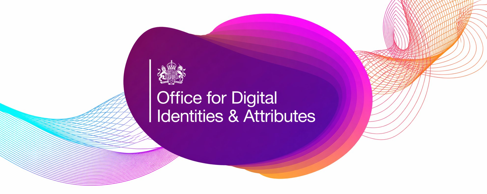

> [!CAUTION]
> This repository is a workspace copy for navigation, drafting, version control and collaboration. It is not the official statement of government policy and must not be relied on as such. For the official published policy, see the [UK digital verification services trust framework 1.0 on GOV.UK](https://www.gov.uk/government/publications/uk-digital-verification-services-trust-framework-1-0/uk-digital-verification-services-trust-framework-1-0-pre-release).

# UK digital verification services trust framework

A Markdown-first, version-controlled workspace for the **UK digital verification services (DVS) trust framework**, maintained on behalf of the [Office for Digital Identities and Attributes (OfDIA)](https://www.gov.uk/government/organisations/office-for-digital-identities-and-attributes).

This repository mirrors the GOV.UK publication as a set of Markdown files so the framework is easier to navigate, review, cite, discuss and propose changes to. Changes made here do not, by themselves, change government policy.

The authoritative publication lives on GOV.UK:

- [UK digital verification services trust framework 1.0](https://www.gov.uk/government/publications/uk-digital-verification-services-trust-framework-1-0/uk-digital-verification-services-trust-framework-1-0-pre-release)

## Trust Framework 1.0

Use the [Trust Framework 1.0 landing page](trust-framework-1.0/README.md) as the main entry point for this version.

The publication is organised into four parts:

- [Part 1 — Background and context](trust-framework-1.0/part-1/README.md)
- [Part 2 — Rules for providers by role](trust-framework-1.0/part-2/README.md)
- [Part 3 — Rules for all service providers](trust-framework-1.0/part-3/README.md)
- [Part 4 — Additional information](trust-framework-1.0/part-4/README.md)

Additional 1.0 material:

- [Version and certification validity notes](trust-framework-1.0/00-version-and-certification-validity-notes.md)
- [Additional information folder](trust-framework-1.0/additional-information/README.md)

## Repository contents

| Folder or file | What it contains |
| --- | --- |
| [`trust-framework-1.0/`](trust-framework-1.0/README.md) | The main 1.0 publication, split into Markdown files. |
| [`media/`](media/README.md) | Figures referenced by the publication, plus reserved filenames for future top-level banner images. |
| [`supporting-material/`](supporting-material/README.md) | Derived artefacts and helper scripts. Not part of the official publication. |
| [`supplementary-codes/`](supplementary-codes/README.md) | Stub folder reserved for future supplementary codes in the same format. |
| [`docs-site/`](docs-site/README.md) | Eleventy-based GOV.UK-styled rendered view of the repository, deployed to GitHub Pages. Not authoritative. |

## Contributing

This repository exists in part to make feedback on the trust framework easier and more structured to gather.

- [`CONTRIBUTING.md`](CONTRIBUTING.md) — how to raise issues, open pull requests and start discussions
- [`.github/ISSUE_TEMPLATE/`](.github/ISSUE_TEMPLATE/) — templates for typo, clarity, structural, accessibility, broken-link, policy-feedback and supporting-material contributions
- [`KNOWN-ISSUES.md`](KNOWN-ISSUES.md) — items already identified by maintainers
- [`SECURITY.md`](SECURITY.md) — how to report a security issue

## Repository design and versioning

- [`ARCHITECTURE.md`](ARCHITECTURE.md) — design decisions behind the repository layout, and how it relates to the GOV.UK publication
- [`VERSIONS.md`](VERSIONS.md) — how multiple publication versions sit side by side in this repository over time
- [`CHANGELOG.md`](CHANGELOG.md) — notable changes to the repository and to the publication text, tracked separately

## Licence

Following the [GDS Way licensing manual](https://gds-way.digital.cabinet-office.gov.uk/manuals/licensing.html), this repository is dual-licensed: documentation under the Open Government Licence v3.0, code under the MIT License. See [`LICENCE.md`](LICENCE.md).

## Related reading

- [Office for Digital Identities and Attributes (OfDIA)](https://www.gov.uk/government/organisations/office-for-digital-identities-and-attributes) on GOV.UK
- [OfDIA blog](https://enablingdigitalidentity.blog.gov.uk/) — ongoing commentary and updates from the team
