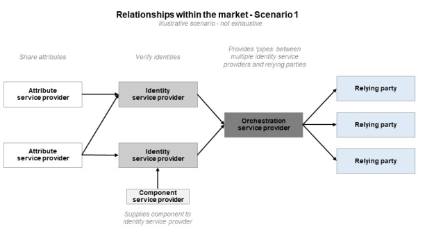
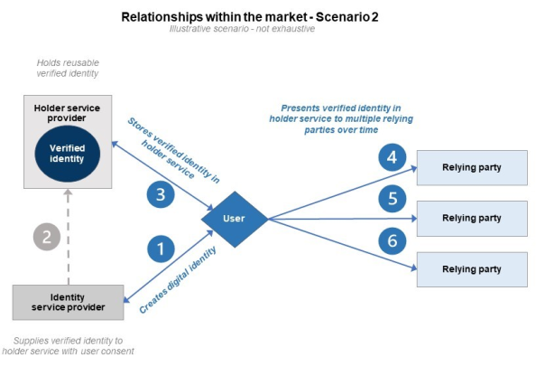

> [!CAUTION]
> This repository is a workspace copy for navigation, drafting, version control and collaboration. It is not the official statement of government policy and must not be relied on as such. For the official published policy, see the [UK digital verification services trust framework 1.0 on GOV.UK](https://www.gov.uk/government/publications/uk-digital-verification-services-trust-framework-1-0/uk-digital-verification-services-trust-framework-1-0-pre-release).

## 4. How organisations participate in the trust framework

4.a. How you choose to participate in the trust framework will determine whether your service(s) needs to become certified and, if so, which trust framework rules are relevant. It is possible for your organisation and/or your service(s) to fulfil multiple roles under the trust framework. If so, you will need to follow the rules for each role. More information is available in [section 4.1.](#section-4_1) on certifiable roles.

4.b. DVS providers who wish to participate in the trust framework must get their service certified against trust framework rules by an [approved trust framework conformity assessment body (‘CAB’).](https://www.gov.uk/guidance/list-of-approved-conformity-assessment-bodies) CABs must be accredited to [ISO 17065](https://www.iso.org/standard/46568.html) by the [UK Accreditation Service (UKAS)](https://www.ukas.com/about-us/) and approved by OfDIA to certify a service against trust framework rules.

4.c. In cases where there is suspicion that trust framework rules are not being followed, an investigation of a certified service’s compliance with the trust framework will be launched by the CAB the provider has contracted with for certification.

4.d. Other participants do not require certification against the trust framework to adopt digital identities, but they may choose to engage with certified services as part of their business operations. More information is available in [section 4.2.](#section-4_2) on other market participants.

### 4.1. Roles with certifiable services

4.1.a. Providers that wish to have their service certified against the trust framework’s rules must perform at least one of the following roles:

- [identity service provider](../part-2/05-rules-for-identity-service-providers.md#section-5)

- [attribute service provider](../part-2/06-rules-for-attribute-service-providers.md#section-6)

- [holder service provider](../part-2/07-rules-for-holder-service-providers.md#section-7)

- [orchestration service provider](../part-2/08-rules-for-orchestration-service-providers.md#section-8)

- [component service provider](../part-2/09-rules-for-component-service-providers.md#section-9)

4.1.b. To be certified, a CAB will need to check that a service follows all the rules for the role(s) it performs. Each role is associated with different capabilities, as the table below summarises:

| Service capabilities | Identity service provider | Attribute service provider | Holder service provider | Orchestration service provider | Component service provider |
| --- | --- | --- | --- | --- | --- |
| Checks identities | ✓ |  |  |  |  |
| Collects, creates or checks attributes |  | ✓ |  |  |  |
| Holds identities and/or attributes over time |  |  | ✓ |  |  |
| Orchestrates interactions between participants |  |  |  | ✓ |  |
| Provides specific part(s) of the identity checking or authentication processes |  |  |  |  | ✓ |
| Relevant sections | Section 5; Sections 10-14 | Section 6; Sections 10-14 | Section 7; Sections 10-14 | Section 8; Sections 10-14 | Section 9; Sections 10-14 |

Figure 1

4.1.c.  A service can perform more than one role concurrently and have this reflected on their certificate. Identity service provider, holder service provider and attribute service provider can all be performed concurrently and in any combination as part of one service. For example, a holder service that derives new attributes from the identity information it holds must seek certification as both a holder service provider and attribute service provider to be certified.

4.1.d. However, a single service cannot be certified under any other role if it is certified as an orchestration service or as a component service. For example, a provider who provides an identity service and also provides a part of this identity service to others as a component service must have their identity service and component service certified separately.

4.1.e. The rules for providers are outcome based. By following them, services will achieve certain goals. The rules do not require the use of specific technologies or processes, but direct services to follow open technical standards where possible to strengthen interoperability between participants. This means providers of certified services will be able to innovate and develop products and services to better support users, without being restricted to using certain technologies.

4.1.f. Once issued, a certificate is generally valid for three years, unless it is suspended or revoked. A certificate applies only to the certified service and cannot be used to imply that any other service, or an organisation as a whole, is certified. The certified service will be subject to regular auditing during that period and must be re-certified prior to its certificate expiring in order to maintain its certified status. OfDIA may require providers of certified services to uplift to a more recent publication of the trust framework less than three years after a certificate has been issued in order to maintain certification. More information about the certification process is available from the CABs.

4.1.g. Certified services may apply to be listed in the public register of digital identity and attribute services. More information is available in [section 13](../part-3/13-the-register-of-digital-identity-and-attribute-services.md#section-13).

#### 4.1.1. Identity service provider

4.1.1.a. An identity service provider checks a user’s identity for one-off use at a single point in time. It can provide services across a range of relationships between users, businesses and government, but will generally work directly with relying parties.

4.1.1.b. An identity service provider can specialise in checking users’ identities or offer identity checking alongside other services. An example of this might be a bank, solicitor, library or postal organisation.

4.1.1.c. An identity service provider does not need to do all parts of the identity checking process itself, but it is responsible for the overall process and its outcome. For example, it may contract with one or more component service providers or other third parties that specialise in providing specific part(s) of the process.

4.1.1.d. If a provider is creating, quality-checking, collecting or sharing attributes as part of its service, for example to create a digital credential, it is also an attribute service provider.

4.1.1.e. If a provider holds and/or supports the reuse of a digital identity, it is also a holder service provider.

#### 4.1.2. Attribute service provider   

4.1.2.a. An attribute service provider collects, creates, checks or shares pieces of information that describe something about a user. It can provide services across a range of relationships such as between users, businesses and government.

4.1.2.b. An attribute service provider can share users’ attributes with relying parties, identity service providers and holder service providers if they confirm a user’s understanding and assess the quality of the attributes before sharing them in order to support those they share them with to understand how much they can trust them.

4.1.2.c. An organisation does not need to do all parts of the attribute collection, creation, checking or sharing processes. It may wish to contract with one or more [component service providers](../part-2/09-rules-for-component-service-providers.md#section-9) or other third parties that specialise in providing a specific part(s) of the process.  

4.1.2.d. Sources of attributes include:

- the public sector, such as organisations providing attributes found in documents, databases and credentials such as passports, driving licences, birth certificates

- attributes issued by private sector organisations, such as a mobile number, bank account balance, credit score, or mortgage;

- an identity created by a certified DVS, either created as part of the same service or shared by another service; and

- attributes issued by checking services such as organisations that confirm the validity and provenance of attributes provided by another service.

4.1.2.e. An attribute service provider could choose to collect attributes to create a digital credential.

4.1.2.f. If a provider holds and/or supports the reuse of attributes for a user, it is also a [holder service provider](../part-2/07-rules-for-holder-service-providers.md#section-7).

#### 4.1.3. Holder service provider

4.1.3.a. A holder service provider creates a user-facing device, service, software or app that allows a user to collect, store, view, manage or share identity and/or attribute information. It securely holds and shares this information, and ensures it is not illegitimately changed, but cannot create new information itself unless it is also performing the identity service provider or attribute service provider role. The user can control what information their holder service stores, when it can be shared, and who it is shared with.

4.1.3.b. Users can keep many different things in their holder service. One form of holder service, called a ‘digital wallet’, is commonly used on mobile phones to hold things such as payment card details or tickets. Other forms of holder services could include:

- reusable digital identities and attributes;

- personal online data stores;

- personal data vaults; or

- services hosting data owned or controlled by many users in a community, e.g., a data co-operative.

4.1.3.c. Holder services can include an ‘account’ functionality. This is a user interface that allows a user to consistently access and manage information held in their holder service. It also allows a provider to directly support and remotely manage a user’s holder service, for instance to facilitate identity recovery processes and respond to fraud incidents.

4.1.3.d. Relying parties can connect directly with a holder service to get information about a user, or there can be another party involved to help with the exchange of information.

4.1.3.e. If a provider wants to check an identity, in addition to holding it for later reuse, it is also an [identity service provider](../part-2/05-rules-for-identity-service-providers.md#section-5).

4.1.3.f. If a provider wants to create new attributes based on information held in a holder service, including deriving attributes, it is also an [attribute service provider](../part-2/06-rules-for-attribute-service-providers.md#section-6).

#### 4.1.4. Orchestration service provider

4.1.4.a. An orchestration service provider makes sure data can be securely shared between participants through the provision of their technology infrastructure. It is not always user-facing.

4.1.4.b. Orchestration services can take many forms and may, therefore, describe themselves in various ways. These may include:

- identity and attribute broker service providers;

- identity and attribute hub service providers; and

- identity access management service providers.

4.1.4.c. We also recognise an emergent role for orchestrators that authenticate and validate the integrity of data received from other trust framework providers. These services may wish to pursue certification as orchestration service providers. We will continue to monitor the market and consider whether some orchestration service providers would be better served by new rules, new sub-roles, or a new role entirely in a future publication of the trust framework.

4.1.4.d. The technical options for orchestrating identities and attributes remain broad and open to innovation. The trust framework sets out the outcomes for orchestration service providers.

#### 4.1.5. Component service provider

4.1.5.a. A component service provider specialises in designing and building components that can be used during part(s) of the identity checking or authentication processes. Identity, attribute or holder service providers can contract with one or more component service providers to provide specific part(s) of their service.

4.1.5.b. For example, component service providers could develop hardware and/or software to:

- provide identity evidence (e.g. facilitate a vouch);

- validate identity evidence (e.g. mobile account validation);

- check identity evidence is genuine (e.g. passport chip reading);

- provide identity fraud services (e.g. fraud database checking);

- provide biometrics verification (e.g. face biometrics); or

- provide non-biometric or biometric authentication (e.g. fingerprint biometrics on a mobile device).

### 4.2. Other participants in the market

#### 4.2.1. Relying party

4.2.1.a. A relying party is an organisation such as an airline, bank or retailer that might not check users’ identities and/or attributes themselves but instead relies on a digital verification service.

4.2.1.b. For example, a relying party might need to make sure a user is who they say they are before letting them do something. To do this, the relying party can ask an [identity service provider](../part-2/05-rules-for-identity-service-providers.md#section-5) to prove a user’s identity. A relying party might also need to check if a user is eligible to do something. It can do this by requesting attributes, or information about attributes, from an [attribute service provider](../part-2/06-rules-for-attribute-service-providers.md#section-6).

4.2.1.c. Relying parties do not need to be certified against the trust framework, but they will be subject to [flow down terms](../part-3/12-service-requirements.md#section-12_9) from any certified services they have a relationship with to ensure the security of the supply chain.

4.2.1.d. In the context of the trust framework, a relying party is an organisation that receives, interprets and – depending on the use case – stores information received from certified services. Organisations which provide additional functions related to the information received, for instance binding it to an individual, will likely also be playing another role under the trust framework alongside being a relying party and may wish to be certified.

4.2.1.e. A digital verification service may only play a small part in a relying party’s wider interactions with a user. For example, a bank may rely on a certified service as part of its onboarding process to check a user’s identity. In this instance, it would be misleading for the bank to claim that its onboarding process was certified against the trust framework, given the certified service is used for identity checking only. Digital verification service providers are responsible for ensuring third parties do not misrepresent the certified and registered status of the services they provide to them (see 11.1.c). 

### 4.3. Relationships within the market

4.3.a. It is up to individual organisations to determine commercial relationships and decide who to work with. Certified services will derive significant assurance, interoperability and user protection advantages from working with other certified services. Relying parties will also derive significant user protection, reliability and security benefits from working with certified services (subject to business need and any regulatory requirements).  

4.3.b. During certification, providers will be required to inform CABs which organisations they work with when providing services that are within the scope of the trust framework. This will help CABs to assess whether appropriate protections are in place throughout a supply chain and evaluate possible risks to other participants. For instance, numerous providers relying on one fraud monitoring service could create a single point of failure in the digital identity and attributes market. CABs will then anonymise and aggregate this information before submitting it to OfDIA who will use it to assess the market, including any emerging risks.

4.3.c. The following are examples of some possible relationships within the market. Please note these are not exhaustive and are for illustrative purposes only.

Figure 2

Figure 3

### 4.4. Supplementary codes

4.4.a. The trust framework’s rules set a baseline for good digital verification services across the UK economy. Individual sectors or use cases may have additional requirements that exceed those in the trust framework, for instance to meet specific legislative or regulatory obligations. To make it easy for relying parties to know how they can use digital verification services to meet these requirements, OfDIA can work with those operating in, or who are experts on, certain use cases or sectors to translate them into additional rules that providers can certify against as part of the trust framework certification scheme. This set of additional certifiable rules is known as a supplementary code.  

4.4.b. OfDIA is responsible for the publication and maintenance of supplementary codes. OfDIA has determined four key principles it will follow to create new supplementary codes:

- like the main trust framework, supplementary codes must be based on consultation with appropriate persons, including relevant regulators;

- like the main trust framework, supplementary codes will be version controlled and developed iteratively;

- the rules of a supplementary code must strengthen rather than undermine the trust framework’s rules; and

- the rules of a supplementary code must fulfil a market and user need.

4.4.c. All the [supplementary codes are collected on GOV.UK](https://www.gov.uk/government/collections/uk-digital-identity-and-attributes-supplementary-codes). There are three supplementary codes at the time of this publication, which describe rules for providers conducting digital right to work, right to rent and Disclosure and Barring Service identity checks. 

>
> ##### Illustrative example 1
>
> An employer is hiring a new employee and needs to conduct a right to work check. The employer would like to conduct the check digitally.
>
> The Home Office allows employers to conduct right to work checks on British and Irish citizens by using a DVS in accordance with their guidance for employers. OfDIA in turn sets rules for providers who offer DVS in such cases, which are set out in [the supplementary code for digital right to work checks](https://www.gov.uk/government/publications/supplementary-code-for-digital-right-to-work-checks-1-0).
>
> This means the employer can work with a DVS that is certified against both the trust framework and [the supplementary code for digital right to work checks](https://www.gov.uk/government/publications/supplementary-code-for-digital-right-to-work-checks-1-0).
>
> The DVS conducts the check on the company’s behalf, confirms the result to the company. The check is successful, so the DVS shares a photo of the employee with the company.
>
> The employer then satisfies themself that the photograph and biographic details provided by the DVS match the employee, meaning they are able to onboard the employee with confidence that the right to work check has been completed in a compliant way.
>

---

**Repository navigation**

[← Previous: 3. Terms and definitions](03-terms-and-definitions.md) · [Part README](README.md) · [Trust Framework 1.0](../README.md) · [Repository home](../../README.md) · [Next: 5. Rules for identity service providers →](../part-2/05-rules-for-identity-service-providers.md)
