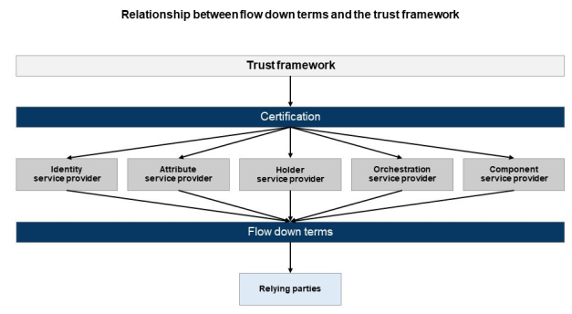

> [!CAUTION]
> This repository is a workspace copy for navigation, drafting, version control and collaboration. It is not the official statement of government policy and must not be relied on as such. For the official published policy, see the [UK digital verification services trust framework 1.0 on GOV.UK](https://www.gov.uk/government/publications/uk-digital-verification-services-trust-framework-1-0/uk-digital-verification-services-trust-framework-1-0-pre-release).

## 12. Service requirements

### 12.1. Making your products and services interoperable with others

#### 12.1.1. Data schema

12.1.1.a. The [trust framework data schema](https://www.gov.uk/government/publications/uk-digital-verification-services-trust-framework-data-schema-1-0) provides guidance for services and relying parties on how to organise and exchange information in a consistent way to enable interoperability.

12.1.1.b. You could use the data schema to help ensure your service is interoperable with other certified services and relying parties. It is recommended that the data schema is followed across the market to encourage interoperability between organisations, in the UK and internationally.

12.1.1.c. The data schema has been written to be consistent with different industry approaches for data exchange and technical standards, such as [OpenID Connect](https://openid.net/connect/) and W3C’s [Verifiable Credentials](https://www.w3.org/TR/vc-data-model/) data models.

#### 12.1.2. Receiving messages from trust framework participants

12.1.2.a. If your service shares data with or receives data from other trust framework participants, you must be able to validate the integrity of messages you are receiving from those participants.

#### 12.1.3. Sharing digital identities and attributes

12.1.3.a. When sharing a user’s digital identity or attribute information with another service or relying party, you must provide enough information for them to be able to:

- identify the person; and/or

- decide if the person is eligible for something.

12.1.3.b. To support the service or relying party to match what you share with the person they’re dealing with , you could provide a:

- first name;

- last name; and

- a unique identifier for the user, such as a user or account number or, where sufficient, their date of birth.

12.1.3.c. A relying party could ask you for information to check if a user is eligible to do something rather than, or in addition to, identifying them. This could include their:

- date of birth, age, or confirmation that their age is above a certain limit;

- nationality;

- place of birth;

- previous name(s);

- email address;

- address;

- phone number;

- gender;

- occupation;

- income;

- tax reference number;

- biometric information;

- passport number;

- qualifications;

- employment history;

- non-UK identity card number; or

- role in an organisation.

12.1.3.d. The relying party will need to decide if the information is sufficient for what they need. Knowing where the attribute comes from and how it has been checked could help them make this decision.

### 12.2. Checking if a user can act on behalf of an organisation or another person

12.2.a. Some users may be acting on behalf of an organisation or another person when they interact with you. This is known as ‘delegated authority’. There are a number of reasons why this might be appropriate, such as:

- the user might have been formally appointed using a lasting power of attorney (LPA) to look after someone else’s money and property;

- the user may be a parent or legal guardian acting on behalf of a child where the child is not old enough to access a service themselves; or

- the user might be appointed to act on behalf of an organisation. To permit a user to act on an organisation’s behalf, you must check their identity, check that the organisation exists and check they can act for that organisation.

12.2.b. A user will only have delegated authority if they have been given permission to make decisions and complete tasks on behalf of the other person or organisation. A user may have delegated authority on a one-time basis, related to one specific task or service, or something more comprehensive. A user does not necessarily have delegated authority if they are helping someone do something. This could include:

- a user helping a friend who is not confident using a computer to fill in an online form; or

- anyone who offers ‘assisted digital support’ to users of a product or service.

12.2.c. You can choose whether to offer delegated authority as part of your service. If your service permits delegated authority of any type, you must follow the [delegated authority guidance](https://www.gov.uk/government/publications/how-to-check-whether-someone-has-delegated-authority-1-0), including checking if the user has the necessary authority to act on someone else’s behalf, and demonstrate how you meet the guidance’s requirements. The details of their agreement with the other person might exist as an attribute.

12.2.d. If you are a [holder service provider,](../part-2/07-rules-for-holder-service-providers.md#section-7) you can allow a user to hold details about the identity or attributes of another person or of an organisation if they have authority to act on that person or organisation’s behalf.

### 12.3. Encryption and cryptography

12.3.a. The requirements in this section outline the minimum expectations for encryption and cryptographic controls and security measures. These are deliberately described as technology and vendor agnostic to cover numerous solutions. How you apply or implement these controls and methods is not prescribed as it is reasonable that the details of your specific implementation will be based on your chosen technologies.

12.3.b. You must carry out a thorough risk assessment of threats that could manifest for your service. In some cases, this will mean you need to exceed trust framework requirements, especially where there is a high risk due to the sensitivity of data.

12.3.c. You must implement cryptographic controls that follow industry standards and best practice for encryption and cryptographic techniques. These must ensure you can protect the confidentiality and integrity of electronic information in transit or at rest, and can mitigate against physical or logical threats.

12.3.d. You must have cryptographic controls that can authenticate the identities of both the sender and recipient to one another. The controls must protect against repudiation.

12.3.e. You must describe these controls and processes in an encryption and cryptographic controls policy document. You must also regularly test and update these controls.

12.3.f. Data on any type of media must be protected from theft.

12.3.g. You must protect your networks from typical hacking activities, such as sniffing data packets across the network. You must also have a robust process to monitor network activity.

#### 12.3.1. Encryption

12.3.1.a. When dealing with data at rest:

- all user-writable partitions on portable devices and portable storage media must be encrypted at the media-level (e.g., full disk encryption);

- information held encrypted at rest must also be integrity protected;

- where multiple layers of encryption are available such as media-level and database field level, you must ensure each layer is applied proportionally to mitigate risks;

- the encryption software deployed on devices must restrict the number of authentication attempts within any given time interval; and

- encryption software deployed on devices must also have sufficient entropy as part of the authentication mechanism. Where passwords are used as the authentication mechanism, the passwords must be of sufficient length to match the password policy defined for the system.

12.3.1.b. When dealing with data in transit, encrypted communications channels must be protected using protocols, protocol suites, and techniques in accordance with industry standards and best practices. You could use one of the following methods:

- at the application layer, using [Transport Layer Security (TLS)](https://www.ncsc.gov.uk/guidance/using-tls-to-protect-data), ensuring this is the latest version;

- at the network layer, using [Internet Protocol Security (IPsec)](https://www.ncsc.gov.uk/guidance/using-ipsec-protect-data); or

- following the [NCSC guidance on using IPSec to protect data](https://www.ncsc.gov.uk/guidance/using-ipsec-protect-data#recprofile) and consulting the most up-to-date cryptography profiles.

12.3.1.c. You could also consult the following NIST guidance:

- [NIST SP 800-213A: Data Protection – Secure Transmission](https://nvlpubs.nist.gov/nistpubs/SpecialPublications/NIST.SP.800-213A.pdf); or

- [NIST SP 800-213A: Device Security – Secure Communication](https://nvlpubs.nist.gov/nistpubs/SpecialPublications/NIST.SP.800-213A.pdf).

#### 12.3.2. Cryptography

12.3.2.a. For further information on handling cryptographic modules, you could consult the following:

- [NIST FIPS 140-2](https://csrc.nist.gov/publications/detail/fips/140/2/final) – Security Requirements for Cryptographic Modules; and

- [NIST FIPS 140-3](https://csrc.nist.gov/publications/detail/fips/140/3/final) – Security Requirements for Cryptographic Modules (140-3 aligns with standards from ISO/IEC).

12.3.2.b. The specific standards and best practices you follow may vary depending on the maturity of the technical approach. As well as the standards above, you could consult the following standards:

- [NIST SP 800-175B](https://csrc.nist.gov/publications/detail/sp/800-175b/rev-1/final) – Guideline for Using Cryptographic Standards in the Federal Government: Cryptographic Mechanisms;

- [ETSI TS 103 458](https://www.etsi.org/deliver/etsi_ts/103400_103499/103458/01.01.01_60/ts_103458v010101p.pdf) – Application of Attribute Based Encryption (ABE) for PII and personal data protection on Internet of Things (IoT) devices, WLAN, cloud, and mobile services.

12.3.2.c. Additional guidance for encryption algorithms can be found in the [ISO/IEC 18033](https://www.iso.org/standard/76156.html) family of standards.

12.3.2.d. For guidance on hash functions, you could read the following standards:

- [ISO/IEC 9797-2](https://www.iso.org/standard/75296.html) – Information security — Message authentication codes (MACs);

- [ISO/IEC 9797-3](https://www.iso.org/standard/51619.html) – Information technology — Security techniques — Message Authentication Codes (MACs);

- [ISO/IEC 10118-1](https://www.iso.org/standard/64213.html) – Information technology — Security techniques — Hash-functions;

- [NIST FIPS 180-4](https://csrc.nist.gov/publications/detail/fips/180/4/final) – Secure Hash Standard (SHS);

- [NIST FIPS 202](https://csrc.nist.gov/publications/detail/fips/202/final) – SHA-3 Standard: Permutation-Based Hash and Extendable-Output Functions; and

- [NIST SP 800-107](https://csrc.nist.gov/publications/detail/sp/800-107/rev-1/final) – Recommendation for Applications Using Approved Hash Algorithms.

12.3.2.e. For key management and generation, you could follow:

- [ISO/IEC 11770-1](https://www.iso.org/standard/53456.html) – Information technology — Security techniques — Key management;

- [ISO/IEC 18031](https://www.iso.org/standard/81645.html) – Information technology — Security techniques — Random bit generation; and

- [ISO/IEC 18032](https://www.iso.org/standard/72009.html) – Information security — Prime number generation.

#### 12.3.3. Entity authentication

12.3.3.a. To evidence how you achieve entity authentication for verification of the sender, there are several cryptography-based mechanisms and protocols you could apply. These could include symmetric systems, digital signatures, zero-knowledge techniques, and checksums. These topics are covered in: [ISO/IEC 9798-1](https://www.iso.org/standard/53634.html) – Information technology — Security techniques — Entity authentication.

#### 12.3.4. Digital signatures

12.3.4.a. Digital signature mechanisms are essential to provide services such as entity authentication, data origin authentication, non-repudiation, and data integrity.

12.3.4.b. It must be computationally unfeasible for an attacker:

- to produce a valid signature on a new message;

- to recover the signature key; or

- in some circumstances, to produce a different valid signature on a previously signed message.

12.3.4.c. It must be computationally unfeasible, even for the signer, to find two different messages with the same signature.

12.3.4.d. If your service includes electronic signatures, and unless you can evidence that another standard achieves the same outcomes, you must follow current Digital Signature Standards, such as:

- [NIST FIPS 186-5](https://csrc.nist.gov/pubs/fips/186-5/final) – Digital Signature Standard (DSS);

- [ETSI TS 119 312](https://www.etsi.org/deliver/etsi_ts/119300_119399/119312/01.04.03_60/ts_119312v010403p.pdf) – Electronic Signatures and Infrastructures (ESI); Cryptographic Suites;

- [ISO/IEC 9796-2](https://www.iso.org/standard/54788.html) – Information technology — Security techniques — Digital signature schemes giving message recovery;

- [ISO/IEC 14888-1](https://www.iso.org/standard/44226.html) – IT Security techniques. Digital signatures with appendix;

- [ISO/IEC 18370-1](https://www.iso.org/standard/62288.html) – Information technology — Security techniques — Blind digital signatures; and

- [ISO/IEC 20008-1](https://www.iso.org/standard/57018.html) – Information technology — Security techniques — Anonymous digital signatures.

12.3.4.e. There are techniques, symmetric and asymmetric, for the provision of non-repudiation services. Digital signatures can be used to provide non-repudiation by ensuring that the sender and receiver of a message cannot deny that they, respectively, sent or received the message. You could follow [ISO/IEC 13888-1](https://www.iso.org/standard/76153.html) – Information security — Non-repudiation to achieve these techniques.

### 12.4. Fraud management

12.4.a. You must follow best practice guidance on fraud management. Best practice can vary between sectors and regulatory environments. For example, this could include:

- [The Chartered Institute of Finance and Accountancy (CIPFA) Code of practice on managing the risk of fraud](https://www.cipfa.org/policy-and-guidance) and its associated [guidance notes](https://www.iasab.org/home/policy-and-guidance/publications/c/code-of-practice-on-managing-the-risk-of-fraud-and-corruption-guidance-notes-pdf) and [assessment tool](https://www.cipfa.org/policy-and-guidance/publications/c/counter-fraud-assessment-tool);

- [Government Functional Standard GovS 013: Counter fraud](https://www.gov.uk/government/publications/government-functional-standard-govs-013-counter-fraud);

- [Government Internal Audit Agency’s standards](https://www.gov.uk/government/publications/public-sector-internal-audit-standards);

- [The Association of Certified Fraud Examiners (ACFE)’s fraud risk management guide](https://www.acfe.com/fraud-resources/fraud-risk-tools---coso/fraud-risk-management-guide); and/or

- [Guidance from the Chartered Institute of Management Accountants](https://www.cimaglobal.com/documents/importeddocuments/cid_techguide_fraud_risk_management_feb09.pdf.pdf).

#### 12.4.1. Fraud monitoring

12.4.1.a. You must have processes in place to monitor for threats to your service and attempted fraud (whether successful or not). Where relevant to your service, these must include:

- misuse of your service – where your service is not being used in compliance with your terms of service or the trust framework;

- impersonation – where someone is using the identity of someone else;

- synthetic identity – where someone is using a made up identity;

- takeover – where someone uses an account that is not theirs; and

- document fraud – where counterfeit, forged or camouflaged documents are being used within your service.

12.4.1.b. Your monitoring processes must take into account all channels that are used to deliver your service.

12.4.1.c. Where relevant to your service, your monitoring processes must include:

- known fraud – you must undertake checks to establish whether there is a potential link to previous incidents of known fraud. This must be done at registration and at sufficient intervals to manage the risk of enabling the use of a synthetic identity or impersonation of a real person. This must include a check on if the individual has been a victim of fraud; and

- evidence failures – you must monitor whether a user fails an evidence check that they should pass, especially in the case of repeated failure. You must have a process to establish whether the failure is indicative of potential fraud.

12.4.1.d. Your fraud monitoring processes must be assessed during internal audits. You must conduct fraud audits at least annually. You must also have a process to establish whether incidents where there is a suspicion of fraud should trigger additional fraud audits or exceptional audits conducted by an independent internal auditor or a third-party.

12.4.1.e. If an identity has been checked at a low level of confidence, has been recently repaired or you have recently detected fraud activity associated with that identity, it is considered ‘higher-risk’, and you must put additional security policies in place. These could include details about how you will work with relying parties to manage higher-risk identities. If you determine an identity to be higher-risk for other reasons, you could apply similar additional security policies.

#### 12.4.2. Policies and procedures for fraud management

12.4.2.a. You must make sure you follow all relevant legislative requirements for the sector(s) you work in or with, including:

- thresholds for investigating;

- data sharing agreements;

- fraud dispute and resolution processes; and

- interacting with individuals you believe or suspect to have committed fraud.

12.4.2.b. You must do a risk analysis and identify the potential ways that someone may use your service for fraud or to carry out fraud against your service.

12.4.2.c. When setting thresholds for investigating, you must consider whether the thresholds could unfairly impact genuine users or allow inappropriate or unacceptable activity to take place. You must demonstrate you review your thresholds at least annually to make sure that they are still effective.

12.4.2.d. If you suspect any criminal activity has taken place, you must have processes in place to prevent further criminal activity and ensure your cooperation with appropriate law enforcement agencies.

12.4.2.e. You must also have a clear understanding of legal and regulatory mechanisms for sharing fraud data. What these are may depend on which industry or sector you are working in.

#### 12.4.3. Reporting fraud

12.4.3.a. You must:

- define a set of indicators to make sure reporting and analysis is consistent;

- have a standardised, structured, clear reporting process for all connected services, organisations, users, regulators, and agencies;

- have minimum operational rules for monitoring fraud and threat alerts;

- following an incident, send reporting and analysis to the relevant authorities to help manage the threat of identity fraud and identity misuse;

- keep a log of any revoked or suspended accounts;

- keep a log of any breaches; and

- advise when an external source has been breached.

12.4.3.b. Information your report could include is, for example:

- the claimed identity;

- all information that was gathered or used during the proofing process;

- any persistent identifiers;

- the indicators discovered, where they came from and details of any actions taken.

- IP addresses used by the user; and

- date, time and session identifiers.

12.4.3.c. The indicators your report includes could relate to:

- evidence that is known to be lost, stolen or revoked;

- evidence that is not known to exist;

- a unique reference number, issue data or expiry date from evidence that is known to be false;

- an email address or phone number that might be compromised, or that has been used to create a lot of accounts recently;

- a user that does not look like the person on a piece of evidence;

- biometric information that does not match what is on the evidence; or

- any other information you have used to determine that the user may not be genuine.

#### 12.4.4. Intelligence and fraud analysis

12.4.4.a. You must have a way to:

- actively look for suspicious activity;

- monitor transactions, including for harvesting of data where a third-party is using your service to gather information and data about your users;

- detect indications of coercive behaviour; and

- carry out threat intelligence.

12.4.4.b. You could carry out this analysis using methods such as:

- device monitoring – analysing if the device can be linked to other registrations, to known fraud or suspicious devices;

- anomaly detection – analysing if there are discrepancies or patterns in key information that are indicative of a potential attack or fraud; and

- velocity detection – analysing if there is repeated use of key information and behavioural discrepancies, such as if the user is not ‘realistic’ or ‘normal’.

12.4.4.c. Where transactions are part of your service, you could follow the [NCSC guidance on transaction monitoring for online services](https://www.ncsc.gov.uk/guidance/transaction-monitoring-for-online-services).

#### 12.4.5. Sharing threat indicators

12.4.5.a. You must:

- have a structured and secure way to send and receive relevant identity and attribute data and intelligence;

- notify all relevant parties, including the victim, if there is a fraud incident;

- have a process for sharing information around detected and mitigated fraud threats; and

- have a process for reporting cyber security and fraud incidents.

12.4.5.b. You could sign up to an agreed shared signals approach for sharing threat and fraud intelligence with other trust framework participants.

12.4.5.c. If fraud or crime is suspected (either during initial interaction with the user or on an ongoing basis) that meets the approved threshold for your industry or sector, you must save the relevant metadata and artefacts (where doing so complies with relevant data protection and other legal considerations) for investigation.

12.4.5.d. You could use open and/or common standards to share cyber threat indicators with other participants, for example [STIX and TAXII](https://www.oasis-open.org/committees/tc_home.php?wg_abbrev=cti).

### 12.5. Responding to incidents

12.5.a. You must have processes for dealing with incidents that could have an impact on your product, service or users. These incidents might be related to:

- fraud, for example if a user’s identity is being used by someone else to sign in to your service;

- service delivery, for example if users cannot use your product or service because it is temporarily unavailable; or

- a data breach.

12.5.b. Your processes must follow industry best practice, such as the [NCSC guidance on incident management](https://www.ncsc.gov.uk/collection/incident-management) and the [NCSC best practice on logging and monitoring,](https://www.ncsc.gov.uk/collection/10-steps/logging-and-monitoring) in addition to any legislative requirements.

12.5.c. You must publish easily accessible details about your incident response processes, including the contact details your customers can use to report an incident. You could also publish the timelines you expect to meet when dealing with incidents.

12.5.d. You must have processes in place to identify, notify and support a user whose information has been compromised due to incidents such as fraud or a data breach. For users with a holder service account, refer to [section 12.5.4.](#section-12_5_4) which details how to do this.

12.5.e. You must have processes in place to manage requests from law enforcement agencies, your CAB, OfDIA or another trust framework participant if they are investigating an incident. You must ensure that you comply with the data protection legislation when responding to any such request.

#### 12.5.1. Responding to a fraud incident

12.5.1.a. You must follow industry best practice and guidance if you suspect that fraudulent activity has taken place, for example if a user is:

- using a synthetic (made up) identity; or

- pretending to be someone they are not, alive or dead.

12.5.1.b. You must have an incident response plan that:

- makes sure effective and timely action is taken if fraud happens;

- explains who in your organisation will be involved in responding to the incident;

- minimises losses for users;

- ensures you collect evidence that could be required for future investigations;

- notifies the relevant organisations if an identity or attribute is found to be fraudulent;

- covers any necessary communication security rules; and

- explains how you will provide law enforcement agencies with information about the incident, in line with legal and regulatory requirements.

12.5.1.c. You must have policies for how you will support a relying party’s investigation if they alert you to a suspected fraud incident involving your product or service.

12.5.1.d. If you discover a suspected fraud incident, you can refer to the [flow down terms](#section-12_9) to establish what support a relying party can provide to investigate the incident.

#### 12.5.2. Responding to a service delivery incident

12.5.2.a. You must have a process for managing and responding to service delivery incidents. This process must follow industry good practice, such as the Information Technology Infrastructure Library (ITIL) service management processes. If you follow different best practices, your process must cover how you will:

- log, categorise, prioritise and assign incidents;

- create and manage tasks;

- manage and escalate service level agreements (SLAs); and

- resolve and close incidents.

#### 12.5.3. Responding to data breaches

12.5.3.a. You must have documented processes for responding to a data breach. These processes must comply with the requirements under data protection legislation regarding data breaches, as explained in the [ICO guidance on how to respond to data breaches](https://ico.org.uk/for-organisations/guide-to-dp/guide-to-the-uk-gdpr/personal-data-breaches/). To report a breach, you can use the [ICO’s online form](https://ico.org.uk/for-organisations/report-a-breach/personal-data-breach/).

12.5.3.b. Data breaches can lead to:

- identity theft;

- threats to a user’s safety or privacy;

- emotional or financial damage to a user; and

- reputational damage to you, and reduced trust in the digital identity ecosystem.

12.5.3.c. If a data breach happens, you must have a process to inform any users whose personal data might have been affected. You must contact them using a method that is appropriate for your users, product or service. You must also inform both OfDIA and your CAB with information about the incident within 72 hours of discovering a data breach, in addition to, where relevant, meeting legal requirements to inform the ICO.

#### 12.5.4. Responding to suspicions that a user’s holder service account is compromised

12.5.4.a. There are a variety of ways that a holder service account can become compromised. This could be the result of deliberate fraudulent activity where an impostor has obtained unauthorised access. This could also happen because there has been a data breach.

12.5.4.b. If a user suspects their holder service account is at risk of being compromised, you must be able to freeze or temporarily suspend it if they request this.

12.5.4.c. If you suspect a user’s holder service account has been compromised, you must complete an investigation to confirm whether fraud has taken place.

12.5.4.d. If during your investigation, you suspect someone who should not have access to a holder service account has either accessed or used it, you must have processes in place to:

- suspend the holder service account until you establish if the user is genuine;

- let the user know their holder service account has been suspended;

- establish if the user is genuine; and

- ask the user to look at their recent holder service account activity, and check if there are any interactions they do not recognise.

12.5.4.e. Your investigation process must mitigate the risks that you could cause emotional distress to a genuine user or educate an attacker on how your fraud controls work.

12.5.4.f. If your investigation concludes that the holder service account has been compromised, you must have a process in place to inform the rightful user (where contact is possible) and support them through the holder service account recovery process if they request it. This recovery process must follow the guidance in [section 6 of GPG 44](https://www.gov.uk/government/publications/how-to-use-authenticators-to-protect-an-online-service-1-0/how-to-use-authenticators-to-protect-an-online-service-1-0-pre-release#section-6) that outlines what to do if an authenticator has been forgotten, lost or stolen.

12.5.4.g. If you also checked the user’s identity, you must check the user’s identity again following [GPG 45](https://www.gov.uk/government/publications/how-to-check-someones-identity-1-0). This check must meet either:

- the same level of confidence originally met but a different identity profile;

- the same level of confidence and identity profile but different identity evidence; or

- a higher level of confidence than the one originally adopted. You could also consider using different identity evidence.

#### 12.5.5. Helping a user repair their identity

12.5.5.a. Identity repair refers to users regaining the use of their rightful identity, such as after becoming a victim of identity theft.

12.5.5.b. You must publish easily accessible contact details that your users can use to get support from you for identity repair.

12.5.5.c. You must also have documented processes in place to advise users on the steps they can take if they have become a victim of fraud.

12.5.5.d These processes must:

- advise the user on immediate measures that can be put in place to protect their account (e.g. withholding pending transactions, changing passwords and securing their wifi);

- advise the user on referring to Report Fraud;

- assess the user’s vulnerability and provide support or signpost them to a victim support service or Citizens Advice;

- inform the user of the process for claims of bank/finance fraud processes, or alternatively, advise the user of the fraud reimbursement process for your organisation; and

- explain how the user can restore their accounts if they have been compromised.

12.5.5.e. These processes must also advise the user on:

- contacting credit referencing agencies (e.g. Equifax, Experian and Transunion);

- opening a credit checking service to ensure their details have not been used to open accounts they are unaware of;

- contacting creditors with whom they have an account (e.g. banks, credit card companies, store cards, phone and utility companies) or, if these accounts have not been affected, advising them that they should monitor their accounts to ensure they remain protected;

- reviewing all passwords for banking, emails and social media and changing them where necessary

- changing passwords associated with accounts that could be compromised, and using a password manager can securely generate and store your passwords;

- the role of identity protection services, (e.g. Cifas);

- advising the user to register their details with the Mailing Preference Service and the Telephone Preference Service;

- registering for free alerts about activity on their property via the [Land Registry;](https://propertyalert.landregistry.gov.uk) and

- any other advice related specifically to your service or sector.

12.5.5.f. Where you are able to confirm an instance of identity theft has occurred, you could, where requested, provide rightful users with evidence to support their onward identity repair.

### 12.6. Telling users about your product or service

12.6.a. You must make sure your users know exactly what your product or service does. You must clearly explain:

- any terms and conditions of use that the user needs to be aware of;

- any fees that the user will need to pay to use your product or service; and

- how you make money from your service (‘business monetisation statement’, clearly labelled as such), where relevant. This must be separate from the terms and conditions and easy for the user to access.

### 12.7. Privacy and data protection rules

12.7.a. Personal data is any information relating to an identified or identifiable natural person. You must follow data protection legislation whenever you do anything with users’ personal data. The [ICO data protection guidance for organisations](https://ico.org.uk/for-organisations/) explains what requirements you must meet, and you must check your legal obligations carefully.

12.7.b. The trust framework does not determine which lawful basis you should use to process personal data. [Choosing an appropriate lawful basis](https://ico.org.uk/for-organisations/uk-gdpr-guidance-and-resources/lawful-basis/a-guide-to-lawful-basis/) is your responsibility if you are a data controller. The lawful basis for processing data is distinct from the additional requirement in the trust framework to confirm a user understands how their data will be shared and processed. The rules for confirming a user’s understanding are set out in [section 10.3](10-inclusivity-accessibility-and-service-design.md#section-10_3). 

12.7.c. Due to the importance of personal data to digital verification services, you will be audited as part of the trust framework certification process to ensure you are complying with data protection legislation and, in particular, that you are meeting the following legislative requirements or related best practice.

12.7.d. This list is not exhaustive of all data protection legislative requirements, but instead highlights areas which are particularly important for certified services. Any ICO guidance referenced explains the law and sets out recommended good practice to meet statutory obligations.

12.7.e. You must:

- have appointed a [data protection officer](https://ico.org.uk/for-organisations/uk-gdpr-guidance-and-resources/accountability-and-governance/guide-to-accountability-and-governance/accountability-and-governance/data-protection-officers/#ib1) (DPO) to carry out the tasks defined in [Article 39 of the UK GDPR](https://www.legislation.gov.uk/eur/2016/679/article/39), even if you do not meet legislative requirements outlined in [Article 37 of the UK GDPR](https://www.legislation.gov.uk/eur/2016/679/article/37);

- identify whether you are a [data controller (including joint controller) or data processor](https://ico.org.uk/for-organisations/uk-gdpr-guidance-and-resources/controllers-and-processors/controllers-and-processors-a-guide/), and demonstrate that you have understood your resulting obligations;

- if you are a data controller, have completed a [Data Protection Impact Assessment](https://ico.org.uk/for-organisations/guide-to-data-protection/guide-to-the-general-data-protection-regulation-gdpr/accountability-and-governance/data-protection-impact-assessments/) (DPIA), also known as a ‘privacy impact assessment’, for your service(s), before processing any data. This must include, amongst other things, justification for your lawful basis for processing, and detail all forms of personal data which may be processed or created as a result of your service (e.g. analytics data);

- be registered with the ICO as a data protection fee payer, unless you are [exempt](https://ico.org.uk/for-organisations/data-protection-fee/data-protection-fee/exemptions/);

- have processes in place to ensure compliance with the ‘[data minimisation](https://ico.org.uk/for-organisations/guide-to-data-protection/guide-to-the-general-data-protection-regulation-gdpr/principles/data-minimisation/)’ principle, particularly when sharing data with other organisations, within the parameters of your particular service or use case;

- have processes in place to ensure ‘[data accuracy](https://ico.org.uk/for-organisations/guide-to-data-protection/guide-to-the-general-data-protection-regulation-gdpr/principles/accuracy/#:~:text=However%2C%20the%20accuracy%20principle%20requires,practice%20to%20consider%20this%20request.)’, including accuracy of personal data you collect and create;

- have established a clear process to ensure compliance with the ‘[storage limitation](https://ico.org.uk/for-organisations/uk-gdpr-guidance-and-resources/data-protection-principles/a-guide-to-the-data-protection-principles/storage-limitation/)’ principle and have set retention periods for the data you hold;

- have a clear process to manage requests related to ‘[right of access](https://ico.org.uk/for-organisations/uk-gdpr-guidance-and-resources/individual-rights/individual-rights/right-of-access/#whatis)’, ‘[right to rectification](https://ico.org.uk/for-organisations/uk-gdpr-guidance-and-resources/individual-rights/individual-rights/right-to-rectification/)’, ‘[right to data portability](https://ico.org.uk/for-organisations/uk-gdpr-guidance-and-resources/individual-rights/individual-rights/right-to-data-portability/)’ and ‘[right to erasure](https://ico.org.uk/for-organisations/uk-gdpr-guidance-and-resources/individual-rights/individual-rights/right-to-erasure)’. These rights have been highlighted for auditing, but you must have a clear process for all data protection rights;

- have given consideration to how your service safely accommodates and protects [children](https://ico.org.uk/for-organisations/uk-gdpr-guidance-and-resources/childrens-information/). If your service is likely to be accessed by children in the UK, you must comply with the [Age Appropriate Design Code](https://ico.org.uk/for-organisations/uk-gdpr-guidance-and-resources/childrens-information/childrens-code-guidance-and-resources/age-appropriate-design-a-code-of-practice-for-online-services/);

- meet the requirements of [Article 22A-C of the UK GDPR and any regulations made under Article 22D,](https://www.legislation.gov.uk/eur/2016/679/chapter/III/section/4A) where automated decision-making is part of your service. This includes having a clear process for managing user requests about their rights with regards to automated decision-making. The [ICO guidance on automated decision-making and profiling](https://ico.org.uk/for-organisations/uk-gdpr-guidance-and-resources/individual-rights/automated-decision-making-and-profiling/) can help you meet legislative obligations; and; and

- follow legislative requirements where your service processes biometric or other special category data. When processing special category data, you need to ensure you have identified a specific condition for the processing under Article 9 of the UK GDPR. The [ICO guidance on special category data](https://ico.org.uk/for-organisations/uk-gdpr-guidance-and-resources/lawful-basis/a-guide-to-lawful-basis/lawful-basis-for-processing/special-category-data/) can help you meet legislative obligations.

#### 12.7.1. Transparency

12.7.1.a. If you are a data controller, you must comply with the UK GDPR [principle of ‘transparency’](https://ico.org.uk/for-organisations/uk-gdpr-guidance-and-resources/accountability-and-governance/accountability-framework/transparency/) by using a privacy notice. In addition to the information which you must provide to data subjects under either [Article 13](https://www.legislation.gov.uk/eur/2016/679/article/13) or [14 of the UK GDPR](https://www.legislation.gov.uk/eur/2016/679/article/14), for the purposes of the trust framework, where [section 10.3](10-inclusivity-accessibility-and-service-design.md#section-10_3) applies, your privacy notice must:

- specifically emphasise the lawful basis you are using for processing personal data; and

- make clear what the role of the user confirmation is.

12.7.1.b. You must regularly review the information you provide to users through the privacy notice and update it as required. You must also inform users of any new uses or changes to the third-party organisations you partner with, before making any such changes.

#### 12.7.2. Privacy by design and default

12.7.2.a. You must follow privacy best practice, including legal requirements, and the [ICO guidance on ‘privacy by design and default’](https://ico.org.uk/for-organisations/guide-to-data-protection/guide-to-the-general-data-protection-regulation-gdpr/accountability-and-governance/data-protection-by-design-and-default/).

12.7.2.b. If you are a data controller, you must also demonstrate that your privacy compliance process follows an industry standard such as [ISO/IEC 27701](https://www.iso.org/standard/71670.html). If you do not follow this standard, you must demonstrate that you have processes to achieve the same outcomes.

#### 12.7.3. Prohibited processing of personal data

12.7.3.a. In addition to legislative requirements in respect of the processing of personal data, you must not collect and process identity or attribute data, including metadata about identity and attribute data, to:

- ‘profile’ users for third-party marketing purposes; or

- create aggregate data sets that could reveal sensitive information about users. You may create aggregate data sets where appropriate anonymisation techniques have been used and you are confident sensitive information will not be revealed about users, or that the user could be re-identified. The ICO has developed [guidance on anonymisation](https://ico.org.uk/for-organisations/uk-gdpr-guidance-and-resources/data-sharing/anonymisation/) that could be helpful to refer to.

12.7.3.b. Your service must not collect, share or otherwise process identity or attribute data without having confirmed the user’s understanding of how their identity and attribute data will be shared and disclosed in accordance with [section 10.3](10-inclusivity-accessibility-and-service-design.md#section-10_3).

### 12.8. Using biometrics in your service

12.8.a. Biometric data (including physical and behavioural biometrics) has a broad range of applications amongst DVS, including its use for both authentication and identification. If you use a user’s biometrics for any purpose, you must follow the rules of this section. When processing biometric data, you must comply with the requirements of data protection legislation. Processing biometric data for identification purposes is processing of special category data, and you must also comply with all the relevant requirements in respect of processing special category data under data protection legislation. This includes completing a Data Protection Impact Assessment as described in [section 12.7.e.](#section-12_7) It may be helpful to review the [ICO guidance on biometric recognition](https://ico.org.uk/for-organisations/uk-gdpr-guidance-and-resources/lawful-basis/biometric-data-guidance-biometric-recognition/).

12.8.b. If you are an identity service provider creating an identity, or a component service provider supporting other service(s) to create identities, for [GPG 45](https://www.gov.uk/government/publications/how-to-check-someones-identity-1-0) confidence profiles up to and including medium, if you offer a non-biometric check as well as a biometric check, you must offer the non-biometric alternative to users at the same time that the biometric option is offered.

#### 12.8.1. Performance and security of biometric solutions

12.8.1.a. Any biometric technology you use must have been developed and tested to be inclusive and accessible. You must specifically be able to demonstrate in a biometric testing report that you have considered whether:

- the number of ‘false matches’ and ‘false non-matches' in your system are appropriate for your security and usability needs;

- the attack presentation classification error rate (APCER), and bona fide presentation attack classification error rate (BPCER) in your system are appropriate for your needs; and

- the performance of any biometric technology you use is consistent across demographics.

12.8.1.b. You must also follow industry standards that cover performance, presentation attack detection and security testing and bias reduction, such as [ISO/IEC 19795](https://www.iso.org/standard/73515.html) and [ISO/IEC 30107](https://www.iso.org/standard/83828.html). If you do not follow these standards, you must demonstrate that you have processes to achieve the same outcomes.

#### 12.8.2. Testing

12.8.2.a. There are two types of biometric tests that you must perform if you are using a biometric system in your service:

- performance testing – how well a system performs in terms of matching a person to their reference template, for example the photo in their passport; and

- security testing – how susceptible a system is to attacks, for example presentation attacks, injection attacks and cyber attacks.

12.8.2.b. Biometric testing can be delivered in the following ways:

- external independent testing delivered by an ISO 17025 ISO/IEC accredited testing laboratory recognised by the International Laboratory Accreditation Cooperation (ILAC) mutual recognition agreement; or

- internal testing delivered within your organisation. This must follow a recognised testing methodology that meets international standards.

12.8.2.c. Biometric testing reports must include information about the specific test environment evaluated. They must also make clear how the test environment relates to your service. For example, test reports relating to a building entry system are not suitable evidence for a remote onboarding system on a mobile device.

#### 12.8.3. Transparency

12.8.3.a. You must explain the performance and security of biometric technologies you use to relying parties, to other services you work with and to your users. This information must be easily accessible and include details of how testing was carried out.

12.8.3.b. When capturing biometric data, you must explain to users what will happen to that data. This includes whether the data is being used for a face match or checked against multiple records, how long the data will be retained, where it is stored and whether it will be used as training data for artificial neural networks. This information must be communicated in easily accessible language.

### 12.9. Working with relying parties

12.9.a. Relying parties do not need to be certified against the trust framework in order to adopt digital identities. However, it is vital that their practices do not undermine the principles of the trust framework.

12.9.b. Where you work directly with a relying party, you must set out flow down terms through your contractual arrangements. These flow down terms seek to ensure relying parties support providers in meeting their certification obligations.

Figure 4 

12.9.c. There is flexibility in how you agree and implement these responsibilities with relying parties. But the terms must ensure the relying party understands its responsibilities that flow down from its contract with you, as well as confirm the boundaries for liability between you and the relying party. You must evidence terms specifically confirming the role of the relying party in supporting:

- [fraud management requirements](#section-12_4);

- [information security requirements](11-operational-requirements.md#section-11_6);

- [data retention requirements](11-operational-requirements.md#section-11_5_2);

- [personal data processing requirements](#section-12_7);

- [data minimisation requirements](#section-12_7), including avoiding excessive processing;

- [data accuracy and repair requirements](#section-12_7);

- [identity repair and recourse requirements](#section-12_5_5);

- the resolution of [incidents](#section-12_5) and [complaints](11-operational-requirements.md#section-11_2); and

- [holder service provider requirements](../part-2/07-rules-for-holder-service-providers.md#section-7) for checking identities and/or attributes again where applicable.

>
> ##### Illustrative example 10
>
> Victoria is shopping in a clothes shop and decides to create a digital identity with the shop’s chosen identity service provider so she can participate in a new digital shopping experience.
>
> Victoria is unhappy with the experience of creating her digital identity and makes a complaint to the shop.
>
> The provider and shop have agreed to work together to help customers with complaints. Given the topic of Victoria’s complaint, the shop passes it to the identity service provider to ensure it is suitably resolved without needing Victoria to make a separate complaint with them directly.
>

---

**Repository navigation**

[← Previous: 11. Operational requirements](11-operational-requirements.md) · [Part README](README.md) · [Trust Framework 1.0](../README.md) · [Repository home](../../README.md) · [Next: 13. The register of digital identity and attribute services →](13-the-register-of-digital-identity-and-attribute-services.md)
